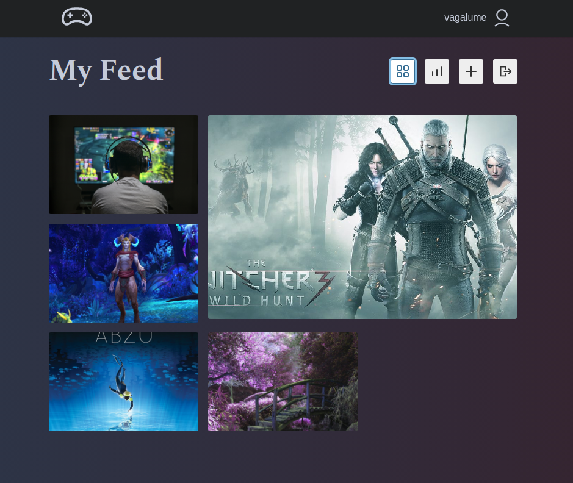

# Gamer Social Network

## Getting Started

To get started with the project locally you should:

- Clone this repository
- Run **npm install** in your terminal to install all the required dependencies
- Run **npm start**  in your terminal to start the local server

## Project overview

This is a personal project that has the main focus of exploring the fronted environment with React using tools such as hooks, custom hooks and Redux as a state manager. 

The project is a social network for gamers, it has the main features of social network applications, the use case diagram below illustrates what actions the user is able to perform in the app:   

  

  

Here is the account feed page:  

  

# Process Behind The Code

Since I was using Redux for state management I had to decide what should be handled with Redux and be sent to the store and what should be handled only in the component level with Hooks. 

So I opted to use following features with Redux:  

1 - **photo** to store the current active single post (photo)

2 - **photoPost** to store a new post when the user uploads a photo

3 - **token** which stores the authentication token 

4 - **user** which stores the logged user's info

5 - **feed** which stores info about the current feed (including individual accounts feed and general feed)

6 - **ui** which stores the current state of modal windows

Below I will explain the basic logic of each reducer in the project.  

### Photo Reducer

This reducer will be responsible for changing the photo state. My approach for dealing with this functionality was a very 'traditional' one. I have the constants, the actions, the initial state all separate and they go through the photo reducer and inside of the switch statement the global state is altered. Of course, in order for all this dynamic to work it is necessary to have a thunk that will dispatch all those actions. There is a small example with one of the actions below:  

### Photo Post Reducer  

For this reducer as well as all the other reducers I decided to take a little less traditional way of handling a the actions in Redux. Instead of having a file with all the constants, actions, thunk and reducer I created a function using the createSlice method that comes from the @reduxjs/toolkit, which is a package that was developed by the Redux team that helps you save a lot of repetition in your code like creating constants, action creators, thunk, configuring the devtools, etc. 

This function allows me to reuse a lot of code. 

