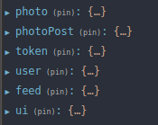

# Gamer Social Network

## Getting Started

To get started with the project locally you should:

- Clone this repository
- Run **npm install** in your terminal to install all the required dependencies
- Run **npm start**  in your terminal to start the local server


## Project overview

This is a personal project that has the main focus of exploring the fronted environment with React using tools such as hooks, custom hooks and Redux as a state manager. 

The project is a social network for gamers, it has the main features of social network applications, the use case diagram below illustrates what actions the user is able to perform in the app:   

  


  

Here is the account feed page:  


  

# Process Behind The Code

Since I was using Redux for state management I had to decide what should be handled with Redux and be sent to the store and what should be handled only in the component level with Hooks. 

So I opted to use following features with Redux:  



1 - **photo** to store the current active single post (photo)

2 - **photoPost** to store a new post when the user uploads a photo

3 - **token** which stores the authentication token 

4 - **user** which stores the logged user's info

5 - **feed** which stores info about the current feed (including individual accounts feed and general feed)

6 - **ui** which stores the current state of modal windows

Below I will explain the basic logic of each reducer in the project.  

### Photo Reducer

This reducer will be responsible for changing the photo state. My approach for dealing with this functionality was a very 'traditional' one. I have the constants, the actions, the initial state all separate and they go through the photo reducer and inside of the switch statement the global state is altered. Of course, in order for all this dynamic to work it is necessary to have a thunk that will dispatch all those actions. There is a small example with one of the actions below:  

```
import { PHOTO_GET } from '../Api';

// CONSTS
const FETCH_PHOTO_STARTED = 'photo/fetchStarted';

// ACTIONS
const fetchPhotoStarted = () => ({
  type: FETCH_PHOTO_STARTED,
});

// INITIAL STATE
const initialState = {
  loading: false,
  error: null,
  data: null,
};

// REDUCER
export default function photo(state = initialState, action) {
  switch (action.type) {
    case FETCH_PHOTO_STARTED:
      return {
        ...state,
        loading: true,
        data: null,
        error: null,
      };
      default:
      return state;
  }
}

// THUNK
export const fetchPhoto = (id) => async (dispatch) => {
  try {
    dispatch(fetchPhotoStarted());
    const { url, options } = PHOTO_GET(id);
    const response = await fetch(url, options);
    const data = await response.json();
    if (response.ok === false) throw new Error(data.message);
    dispatch(fetchPhotoSuccess(data));
  } catch (error) {
    dispatch(fetchPhotoError(error.message));
  }
};
```

### Create Async Slice 

For  all the other reducers I decided to take a little less traditional way of handling a the actions in Redux. Instead of having a file with all the constants, actions, thunk and reducer I created a function called **createAsyncSlice** using the createSlice method that comes from the @reduxjs/toolkit, which is a package that was developed by the Redux team that helps you save a lot of repetition in your code like creating constants, action creators, thunk, configuring the devtools, etc. 

This function allows me to reuse a lot of code, it receives a config object as argument a that will provide the name, properties to include in the initial state, reducers to add to the default reducers and a function that will return the url and options (body, headers, etc) that will be used in the Thunk that will dispatch the actions. 

You can it in the image below:  

```
// import the createSlice
import { createSlice } from '@reduxjs/toolkit';
/**
 * Create a slice with an async function
 * @param {Object} config
 * @param {String} config.name
 * @param {Object} config.initialState
 * @param {Object} config.reducers
 * @param {Function} config.fetchConfig
 */
const createAsyncSlice = (config) => {
  const slice = createSlice({
    name: config.name,
    initialState: {
      loading: false,
      data: null,
      error: null,
      ...config.initialState,
    },
    reducers: {
      fetchStarted(state) {
        state.loading = true;
      },
      fetchSuccess(state, action) {
        state.loading = false;
        state.data = action.payload;
        state.error = null;
      },
      fetchError(state, action) {
        state.loading = false;
        state.data = null;
        state.error = action.payload;
      },
      resetState(state) {
        state.loading = false;
        state.data = null;
        state.error = null;
      },
      ...config.reducers,
    },
  });

  const { fetchStarted, fetchSuccess, fetchError } = slice.actions;
  const asyncAction = (payload) => async (dispatch) => {
    try {
      dispatch(fetchStarted());
      const { url, options } = config.fetchConfig(payload);
      const response = await fetch(url, options);
      const data = await response.json();
      if (response.ok === false) throw new Error(data.message);
      return dispatch(fetchSuccess(data));
    } catch (error) {
      return dispatch(fetchError(error.message));
    }
  };

  return { ...slice, asyncAction };
};

export default createAsyncSlice; 
```

#### User Reducer

So, let's use the user reducer as an example to illustrate how this function works, following this steps:

1 - Use the createAsyncSlice function to set all the necessary environment that will dispatch the action to change the state of the user.  

```
const slice = createAsyncSlice({
  name: 'user',
  fetchConfig: (token) => USER_GET(token),
});
export const fetchUser = slice.asyncAction;
const { resetState: resetUserState, fetchError } = slice.actions;
```


2 - Create the action creator that will be responsible to dispatch the fetchUser.

```
export const userLogin = (user) => async (dispatch) => {
  const { payload } = await dispatch(fetchToken(user));
  if (payload.token) {
    window.localStorage.setItem('token', payload.token);
    await dispatch(fetchUser(payload.token));
  }
};
```


3 - Inside the LoginForm component, validate the values in the login inputs and if they are valid dispatch userLogin function.

```
const LoginForm = () => {
  const username = useForm();
  const password = useForm();

  const dispatch = useDispatch();
  const { token, user } = useSelector((state) => state);
  const loading = token.loading || user.loading;
  const error = token.error || user.error;

  async function handleSubmit(event) {
    event.preventDefault();

    if (username.validate() && password.validate()) {
      dispatch(
        userLogin({ username: username.value, password: password.value }),
      );
    }
  }  
```


This flow is the same that I used for logout and auto login, just adjusting specific features of each situation to fit this logic. 

```
export const userLogout = () => async (dispatch) => {
  dispatch(resetUserState());
  dispatch(resetTokenState());
  window.localStorage.removeItem('token');
};

export const autoLogin = () => async (dispatch, getState) => {
  const { token } = getState();
  if (token?.data?.token) {
    const { type } = await dispatch(fetchUser(token.data.token));
    if (type === fetchError.type) dispatch(userLogout());
  }
};
```


Basically, this was the main workflow that I used throughout the entire application in order to manage the state with Redux. The thing I liked the most about this approach is that I can reuse many parts of the code while maintaining a lot of freedom to each situation. I ended up saving a lot of time once I figure out this React-Redux flow of work.  

  

## Lessons Learned

- Improved my hability to plan components before starting the developement phase
- How to create an strategy for the usage of Redux
- Understood how to use Redux to manage the state of an application
- Infinite scroll technique with React


## Conclusion

I think one of the most important takeaways I had from this project was the reinforcement of the idea that that many times the right and consistent use of programming principles will present you with practical and useful solutions. For example, the **createAsyncSlice** function which was very important for the flow of the project was create by the application of the **DRY** principle. This function is the combination of elements that kept being repeated everytime I had to create a reducer (and those became createAsyncSlice function structure) with the elements that changed according to the situation (those became the arguments for the createAsyncSlice function). 


  


